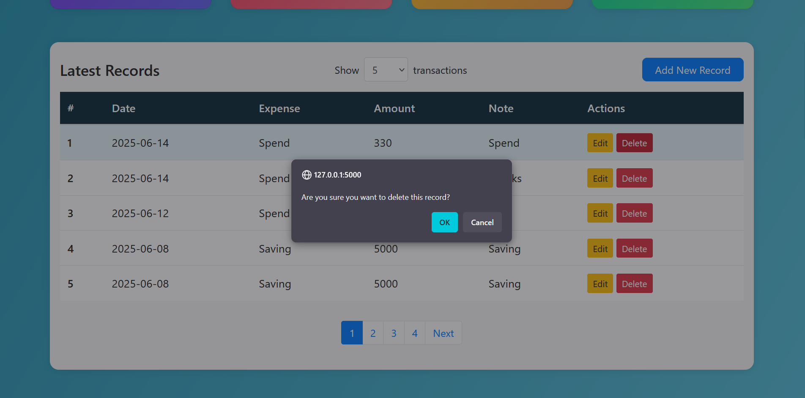

<p align="center">
  
</p>
<h1 align="center">💰 SpendWise</h1>

<p align="center">
  
  
  
  
</p>

<p align="center">
  A clean, interactive, and user-friendly personal finance tracker built with Flask and Plotly.
  <br><br>
  Track income, expenses, savings, and investments — all in one place.
</p>

<p align="center">
  <a href="#overview">Overview</a> •
  <a href="#installation">Installation</a> •
  <a href="#features">Features</a> •
  <a href="#usage">Usage</a> •
  <a href="#license">License</a>
</p>


## Overview

**SpendWise** is a clean and modern personal finance tracker built with Flask.  
It empowers you to **track income, expenses, savings, and investments** in a visually intuitive dashboard using Plotly charts.

Whether you're trying to manage your monthly budget, plan savings, or analyze your financial habits—SpendWise provides an elegant and interactive platform to do it all.

🎯 Key Use Cases:
- Record and categorize daily transactions
- Visualize financial health with charts
- Analyze earning, spending, and saving trends
- Plan budgets and spot overspending patterns

## Prerequisites
To fully utilize the features and capabilities of SpendWise, users must have the following prerequisites installed on their system:

1. Python 3.13 or higher
2. Flask web framework
3. Plotly for data visualization
4. Pandas for data manipulation
5. Basic understanding of HTML, CSS, and JavaScript for designing the front-end interface.

With these tools and technologies, users will be able to run the application and access its 
powerful expense tracking, analysis and visualization features.


## Project File Structure
    ```
    SpendWise/
        main.py
        support.py
        requirements.txt
        templates/
            login.html
            register.html
            home.html
            analysis.html
            profile.html
            contact.html
        static/
            css/
                style.css
            js/
                script.js
    ```

## Installation

1. Clone the repository:  
   ```bash
   git clone https://github.com/harshithdeva/Spendwise.git
   ```

2. Install the required packages:  
   ```bash
   pip install -r requirements.txt
   ```

3. Set the environment variable for the Flask secret key:

   **Linux/macOS**  
   ```bash
   export SECRET_KEY="your-secret-key"
   export RECAPTCHA_ENABLED=True
   export RECAPTCHA_SITE_KEY="your-site-key"
   export RECAPTCHA_SECRET_KEY="your-secret-key"
   ```

   **Windows (PowerShell)**  
   ```powershell
   $env:SECRET_KEY="your-secret-key"
   $env:RECAPTCHA_ENABLED="True"
   $env:RECAPTCHA_SITE_KEY="your-site-key"
   $env:RECAPTCHA_SECRET_KEY="your-secret-key"

   ```

4. Run the application:  
   ```bash
   python main.py
   ```

## Features

### ✅ Modern, Responsive Dashboard  
Enjoy a visually appealing interface with glassmorphism-inspired cards, subtle backgrounds, and a consistent color scheme across all charts and panels.

### 🔐 Secure Authentication  
Robust login and registration system with secure password management.  

- Passwords are **hashed using Werkzeug's security module** before being stored in the database.  
- Sessions automatically expire after **20 minutes of inactivity**, with a user prompt before termination to ensure data safety.  


### 🛡️ CSRF Protection  
All forms and delete operations are secured using CSRF tokens. The app includes CSRF protection headers for AJAX requests to prevent cross-site request forgery attacks.

### 🔐 Google reCAPTCHA v3 Integration  
SpendWise implements Google reCAPTCHA v3 to prevent spam and malicious bot activity on the login, registration, and contact pages. This helps enhance the platform’s security and reliability.

### 💼 Expense Overview & Quick Actions  
The home page provides a financial summary, recent records, and interactive tiles for earnings, spending, investments, and savings. Easily add new records using a streamlined modal form.

### 📊 Advanced Data Visualization  
Visualize your finances with interactive charts — including pie, bar, line, sunburst, scatter, and heatmap plots. All charts are styled to maintain clarity and consistency with the overall dashboard design.

### 📈 Detailed Analysis Page  
Dive deeper into your financial data through a suite of advanced, responsive plots. Layouts are optimized for readability across screen sizes.

### 🧾 Transaction Report Generator  
Users can now generate and download a CSV report of their transactions for any custom date range directly from the dashboard. This allows for offline access, budgeting, or further analysis using spreadsheet tools.

### 👤 Profile Management  
Update your name, email, and password from the profile page. All changes are securely validated and applied instantly.

### 📬 Contact & Feedback  
Easily reach out to the support team via phone, email, or address. You can also submit feedback or queries directly from the contact page.


## Usage

### 🔐 1. Login Page

The login page acts as the entry point to **SpendWise** and includes:
- **User Authentication**:  
  Users can securely log in using their registered email and password.

- **Error Handling**:  
  If incorrect credentials are entered, an error message is displayed.

- **Access Restriction**:  
  The home page and other protected pages are accessible only after login.

- **Password Recovery**:  
  Users can reset their password using the **Forgot Password** option.

- **Navigation Links**:  
  Users can access the **Register** or **About** page from here.

<p align="center">
  
</p>

    
### 🔑 2. Forgot Password

If users forget their password, **SpendWise** offers a secure and simple way to reset it.
- Users click on **"Forgot Password"** on the login screen.
- They enter their **registered email address** and **new password**.
- If the email exists in the system:
  - The password is updated.
  - The user is redirected back to the login page.
- If the email does **not** exist:
  - An alert notifies the user that the account was not found.
- This helps prevent account lockout while maintaining security.

> ⚠️ *Note: Password reset does not perform email verification. Anyone with a known email address could potentially reset it.*
> 🚧 *Upcoming: A secure password reset mechanism via email and email verification during registration are currently in development.*

<p align="center">
  
</p>

The login page will be the gatekeeper to the webapp and responsible for securing the app by allowing access only to authorized users. With the inclusion of these features, the login page will provide a convenient, secure, and user-friendly experience for all users.

### 📝 3. Registration Page

New users can quickly register on **SpendWise** to begin tracking their finances.

- Navigate to the **Register** page via the login screen.
- Provide a **name**, **email**, and **password**.
- If the email is not already in use:
  - The user is registered and redirected to the Home page.
- If the email already exists:
  - An alert informs the user to log in instead.
- Users cannot access the register page once logged in (session-based restriction).
- Users can also navigate to the  **Login** or **Contact** page for further support.

> ✅ This ensures only unique accounts are created and simplifies onboarding.

<p align="center">
  
</p>


### 🏠 Home Page

- The Home page provides a clean and organized **dashboard** that summarizes your recent financial activity.
- View **interactive charts** and statistics representing your earnings, expenses, investments, and savings.
- A **modal-based form** allows users to quickly add new transactions categorized under Earning, Spend, Investment, or Saving.
- Records are displayed in a **chronological table** for easy tracking and editing.
- Features summary tiles showing totals and balances, all styled consistently with the app's modern gradient theme.
- User can **edit or delete** any transaction directly from the dashboard.
- All plots are built using **Plotly**, making them interactive and responsive.
- This page serves as the control center for your personal finance tracking and updates in real-time.

<p align="center">
  
  
  
  
  
  
  
</p>


### 📊 Analysis Page

- Dive deeper into your financial data using a wide range of **interactive, visually-rich charts** powered by Plotly.
- Includes **Pie Charts**, **Bar Charts**, **Line Graphs**, **Scatter Plots**, **Heatmaps**, and **Sunburst Diagrams** to help you explore trends, breakdowns, and spending behavior.
- Visualizations cover:
  - Monthly and yearly comparisons  
  - Category-wise spending and earnings  
  - Expense trends over time  
  - Proportions of income vs. saving vs. investment
- Designed to be **responsive and easy to read**, whether you're on desktop or mobile.
- Charts can be **exported** in multiple formats for sharing or offline analysis.

> 🔒 **Note:** Only accessible when logged in. All visualizations are personalized for the logged-in user.

<p align="center">
  
  
</p>

### 📄 Transactions Report Page

- Generate a detailed **CSV report** of your transaction history by selecting a **start** and **end date**.
- Upon submission, the system filters all transactions within the chosen range and prepares a clean, downloadable CSV file.
- Each report includes:  
  - Date of transaction  
  - Category (Earning, Spend, Investment, Saving)  
  - Sub-category (e.g., Rent, Salary, Mutual Funds)  
  - Amount  
  - Notes/description
- Useful for **bookkeeping**, **monthly reviews**, or **financial summaries**.
- The report is user-specific and accessible only to the logged-in user.
- Ensures privacy and convenience by processing the data in-memory and triggering a download directly.

> 🧾 *CSV reports help you analyze finances offline or share them easily with accountants, family, or budgeting tools.*

<p align="center">
  
</p>

### 👤 Profile Page

- View and manage your **personal details** like name and email in a clean, card-based layout.
- Update your information securely—changes are reflected instantly and validated for correctness.
- Includes password update functionality with proper validation.
- Only accessible to the **logged-in user**.
<p align="center">
  
</p>

---

### 📞 Contact Page

- Get in touch with the SpendWise team through a sleek contact form.
- Submit **queries, suggestions, or feedback** directly from the interface.
- Includes fields for **name, email, phone**, and **message**.

<p align="center">
  
</p>


## License
SpendWise is open-sourced under the MIT license.

## ✅ Conclusion

**SpendWise** is more than just a budget tracker—it's your personal financial assistant. With secure authentication, rich dashboards, and insightful visualizations, SpendWise empowers users to understand, manage, and grow their finances.

Whether you're tracking daily expenses or planning long-term goals, the app offers a clean interface and actionable data to help you stay in control. As we continue to expand the feature set—including report generation, SQL migration, and AI insights—SpendWise will evolve into a full-fledged personal finance platform.

Take charge of your money—one transaction at a time.
